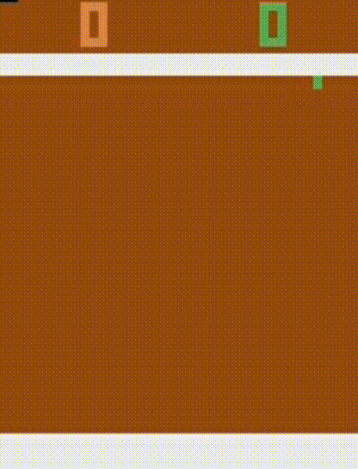

# Aprendizaje por refuerzo en juegos
El siguiente repositorio tiene la implementación realizada para el TFM con mismo nombre prensentado en Universidad de Sevilla. En el se estudia los algoritmo de Q Learning y Deep Q Learning aplicados a diferentes entornos de OpenAI Gym, en concreto al Frozen Lake, Mountain Car, Pong y Super Mario Bross. Para realizar este proyecto tambien se ha utilizado PyTorch para contruir las redes neuronales necesarias y TensorBoard para la contrucción de gráficas que nos permitan verificar el aprendizaje.

# Estructura y Organización
El proyecto se organiza en las siguientes carpetas:

* Carpeta raiz: tendrá el codigo con las funciones necesarias para entrenar los agentes.
* Carpeta videos: se muestran los resultados en formato de gif y mp4.
* Carpeta games: tiene los modelos obtenidos para cada experimento y los resultados en tensorboard.
* Carpeta documentación: tiene el TFM relacionado con este repositorio.
* Carpeta commons: contiene en una plantilla con el funcionamiento general de un algoritmo de aprendizaje por refuerzo y la clase encargada de generar los informes de resultados.
* Caperta commons / algorithms: contiene la implementación concreta de los algoritmos de Q Learning y Deep Q Learning.
* Caperta commons / network: contiene la implementación concreta de las redes neuronales que se utilizarán.
* Caperta commons / wrappers: contiene los envoltorios que se utilizan para algunos entornos de OpenAI Gym

# Instalación
pip install -r requirements.txt

# Pruebas
Los ficheros en la carpeta raiz tiene todos un punto de entrada en la función main, desde se podrá llamar a la función runTrain, runPlay o runSample. Para arrancar un entrenamiento se deberá llamar a runTrain indicando el numero de episodios y el tamañao máximo de pasos para cada uno de ellos. En cada una de estas funciones se puede ver el directorio donde se guardará tanto el modelo como los graficos que muestran la evolución del entrenamiento. Para probar el modelo obtenido se puede hacer con runPlay, indicando la subcarpeta donde se ha generado la información.

Podemos lanzar los entrenamiento como por ejemplo: python mario-dql.py

# Resultados
<section markdown="1" style="display: flex;">
  
  
  
  
</section>

###### Nota
El codigo realizado en este proyecto está pendiente de mejora. Por falta de tiempo y teniendo como premisa la obtención de resultados se a dejado de lado el rigor a la hora de la implementación, habiendo carencias que deberían ser solucionadas. Gracias por la compresión.
